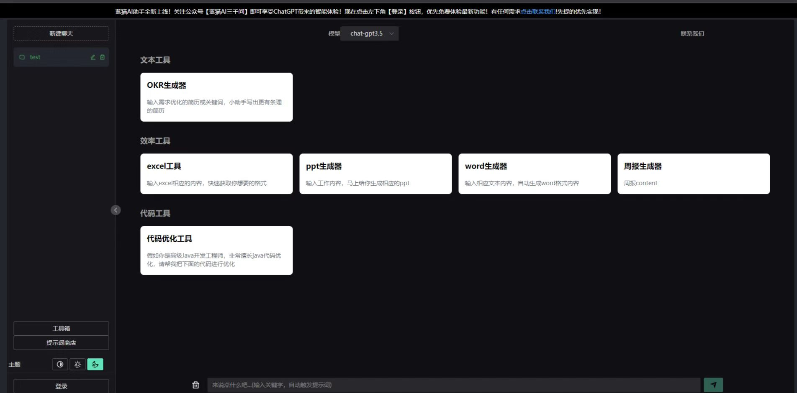
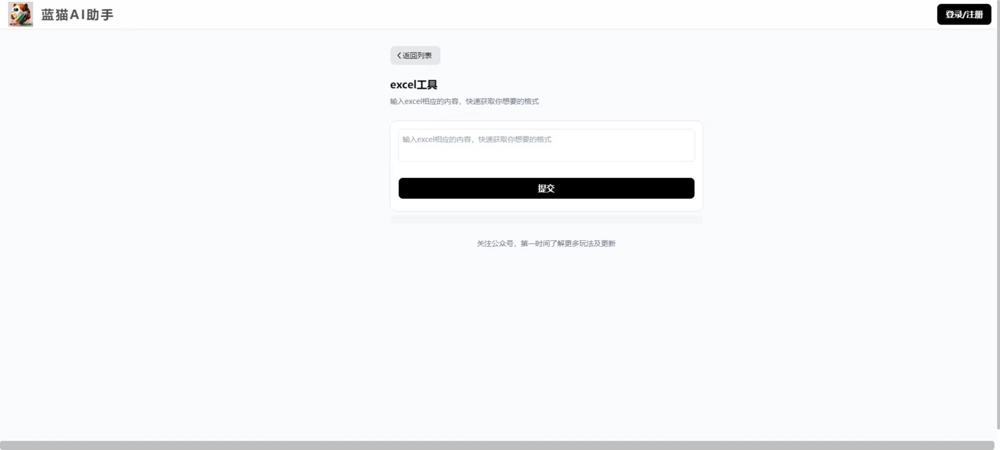
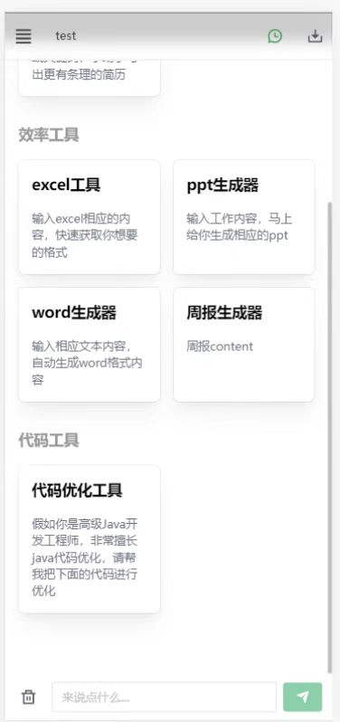

### 前端ui采用：https://github.com/Chanzhaoyu/chatgpt-web 二开  特别鸣谢大佬的模板
### 效果可以体验 ： http://www.chosen1.xyz/
### 对应后端项目开源地址：https://gitee.com/lixinjiuhao/chatppt-java-web
##上效果图








###前端页面入口详解

    src/views/chat/layout/Layout.vue  -- 聊天页面的整体布局
    src/components/common/PromptStore/index.vue  -- 提示商店的页面入口

    src/views/chat/layout/sider/Footer.vue -- 左下部的页面入口
        src/views/chat/layout/sider/index.vue  -- chat聊天页面的 功能列表（用户信息 + 提示词商店）
        src/components/common/UserAvatar/index.vue  - chat聊天框的 首页头像+用户昵称和描述

    src/components/common/Setting/index.vue - chat首页设置的入口
        src/components/common/Setting/General.vue  -- 常规信息（目前系统的个人信息页面入口）
        src/components/common/Setting/About.vue   --  团队介绍的入口

## 前端组件地址：
    element-plus: https://element-plus.org/zh-CN/component/button.html
    naiveui: https://www.naiveui.com/zh-CN/os-theme/components/button

## naive-ui更换全局主题导致 Ninput的边框显示不了的问题
    使用 NConfigProvider 组件来创建一个独立的主题配置
    import {NConfigProvider } from 'naive-ui'
    <n-config-provider >
        <NInput  v-model="value" />
    </n-config-provider>

## naive-ui更换全局主题导致 ninput的边框显示不了的问题
    使用 NConfigProvider 组件来创建一个独立的主题配置
    import {NConfigProvider } from 'naive-ui'
    <n-config-provider >
        <NInput  v-model="value" />
    </n-config-provider>

## 前置要求

### Node

`node` 需要 `^16 || ^18 || ^19` 版本（`node >= 14` 需要安装 [fetch polyfill](https://github.com/developit/unfetch#usage-as-a-polyfill)），使用 [nvm](https://github.com/nvm-sh/nvm) 可管理本地多个 `node` 版本

```shell
node -v
```
### 前端
根目录下运行以下命令
```shell
npm install
```
### vue3安装element-plus
    1.更改淘宝的npm源
    npm install -g cnpm --registry=https://registry.npm.taobao.org
    2.执行：npm install element-plus --save

### 前端网页
根目录下运行以下命令
```shell
开发环境：
  文件：.env
  运行：npm run dev
  打包：npm run build
```
```shell
生产环境：
  文件：.env.prod
  运行：npm run prod
  打包：npm run build:prod
```
